<div align="center">

# 👽 Alien vs Human Dataset 👓

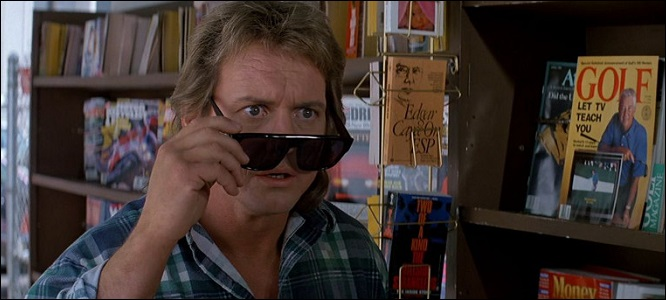

</div>

## 🎯 Content

This repository contains a dataset designed for **demonstration purposes**, taking inspiration from the John Carpenter’s movie *They Live* (1988), available for free on the YouTube platform, to explore object detection and classification pipelines using two well-known machine-learning models:

- **[Google's MobileNetV2](https://www.tensorflow.org/api_docs/python/tf/keras/applications/MobileNetV2)[^1] (classification)**
- **[Ultralytics' YOLOv8n](https://docs.ultralytics.com/models/yolov8/)[^2] (object detection)**

[^1]: Mark Sandler, Andrew Howard, Menglong Zhu, Andrey Zhmoginov, Liang-Chieh Chen (2019). *MobileNetV2: Inverted Residuals and Linear Bottlenecks* (Version 4.0.0) [cs.CV]. https://arxiv.org/abs/1801.04381

[^2]: Glenn Jocher, Ayush Chaurasia, Jing Qiu (2023). *YOLO by Ultralytics* (Version 8.0.0) [Computer software]. https://github.com/ultralytics/ultralytics

The **same dataset is provided, rearranged to fit each model’s requirements**, allowing you to experiment with both **workflows side-by-side**.

### Dataset Constitution

- **Images:** Size 224x224 with consistent scenes and objects under controlled conditions.
- **Capture:** USB 2Mpx Camera, Variable focal length, 2.8-12mm lens, Manual focus, 320x240 MJPG @ 120FPS.
- **Lighting:** LED Spot lighting to reduce shadows and reflections.
- **Background:** A wooden plank.

### Purposes

- Describe convolutional neural networks as well as YOLOv8n and MobileNetV2 architectures.
- Understand basic model training workflows and practical considerations.
- Learn how to create a dataset for training classification/detection models.
- Explore how to automate the labeling process using Python, in a practical case.

### 📜 License

- **Datasets (`data_mnetv2/`, `data_yolov8n/`) and figures:** Released under the [Open Data Commons Public Domain Dedication and License (PDDL) v1.0](LICENSES/PDDL-1.0.txt).
- **Code:** Released under the [MIT No Attribution License](LICENSES/MIT-0.txt).

The code is intended to be adapted as needed depending on your specific model training requirements.

### ✨ Credits

I would like to thank [**Selva Systems**](https://selvasystems.net/), where I completed my internship, for providing the resources that allowed me to capture this dataset, then train and test a [YOLOv8n](https://docs.ultralytics.com/models/yolov8/) model on an [Orange Pi Zero 3](http://www.orangepi.org/html/hardWare/computerAndMicrocontrollers/details/Orange-Pi-Zero-3.html) SBC, with the [Coral USB Accelerator](https://coral.ai/products/accelerator), as part of a project described in my [Edge AI with Orange Pi](https://github.com/chxadr/edgeai-orangepi) repository.

## 📝 Common Tasks and CNN

> [!WARNING]
> This section is quite detailed and is intended for readers who wish to understand:
> - what Convolutional Neural Networks (CNNs) are,
> - their basic structure,
> - and how they are implemented in MobileNetV2 and YOLOv8n.
> 
> This level of detail is somewhat off-track for the main focus of this repository, so feel free to **skip through** [TLDR - CNN](#tldr---cnn) section if you only want to train the models without diving into their architectural background.

### Brief Introduction

**AI models are often trained to perform tasks that are common and intuitive for humans** — such as recognizing objects, classifying images, or detecting motion. Despite their simplicity from a human perspective, **these tasks are essential in many applications.**

Thanks to their ability to process **different kind of data**, *with specific architectures and appropriate training*, **AI models can be integrated into a wide range of systems, as an interface or smart layer between modules and components.** They can both **extract low-level features** from complex signals, *like images*, or **produce high-level information** with raw data, *like electrical signals from different sensors*, enabling automation, monitoring, and intelligent decision-making across systems.

**Importantly, these tasks nowadays do not always require large models**, thanks to very proactive research in *model optimization and lightweight architectures*. **They can often run on single-board computers (SBCs) without relying on cloud resources.** Many of SBCs now integrate **NPUs** (*Neural Processing Units*) or **TPUs** (*Tensor Processing Units*) that allow for **fast and energy-efficient** inference.

Even **GPUs** (*Graphics Processing Units*), like those found on personnal computers, are now integrated in embedded systems, providing more compute power and inference speed at the cost of a larger power consumption. Additionally, **external inference accelerators** — *featuring fast memory alongside NPU, TPU, or GPU cores* — can be connected to fill in the gap for weaker SBCs, providing additional compute power where onboard resources are limited.

#### 📌 Examples 

- A lightweight model running on a SBC can act as a *virtual sensor*, detecting the presence of people in a room by gathering the data of a network of *real sensors*, to optimize heating, ventilation, and air conditioning (HVAC) systems, by directly or indireclty operating on actuators.

- Image classification models can sort defective products on a production line in real-time, providing *image-based quality control* without human intervention, by extracting low-level features from frames captured by a camera.

However, not every model architecture is suitable for every type of application.

#### 🏠 Architecture

An **AI model architecture** refers to the *structure and design of the model*, defining how its **layers**, **operations**, and **connections** are organized to process data and learn patterns.

For example:

- In **neural networks**, the architecture includes the number and types of layers (convolutional, recurrent, fully connected), how they are connected, activation functions used, and the flow of data through them.

- In **machine learning models**, it could refer to the specific structure of a decision tree or the kernel used in a support vector machine.

The architecture determines:

- What kind of data the model can handle effectively (e.g., images, sequences, tabular data).

- How efficiently it can learn and make predictions.

- The resources it requires (compute, memory, energy).

**CNN** (*Convolutional Neural Network*) is a well-known AI model architecture. This type of deep learning network has been applied to process and make predictions from many different types of data including text, images and audio.

---

### CNN

#### 🔬 Origins

**Convolutional Neural Networks** are a class of neural network architectures originally designed to efficiently process grid-like data structures, particularly images. Their conceptual roots trace back to the **1960s** when **Hubel and Wiesel** studied the *visual cortex of cats*, discovering that certain neurons responded specifically to edges and orientations in their visual field. This biological insight led to the idea of **local receptive fields and hierarchical feature extraction**, foundational principles for CNNs.

Building on these ideas, **Kunihiko Fukushima** proposed the *Neocognitron* in 1980, introducing the notion of cascading layers for pattern recognition. In 1989, **Yann LeCun** developed the first practical CNN, *LeNet*, which successfully recognized handwritten digits, demonstrating the effectiveness of learning local features followed by classification layers.

#### 🔩 Technical aspects

Here is a **simplified explanation** of how Convolutional Neural Networks work.

<div align="center">

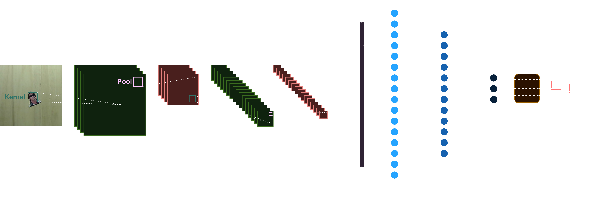

***Figure 1:** 2D CNN example for classification task.*

</div> 

<br>

1. **Input Layer** 
    
The input to a CNN is represented as a tensor, a multi-dimensional array, of values. It can be a time sequence of scalar data (vector), a gray-scaled image (matrix), an RGB image, a sequence of RGB images, etc.

***Figure 2*** is an example of input: *a colored 224×224 image in RGB scale*. For each channel (Red, Green, Blue), a pixel has a value ranging from *0 to 255* for `uint8` representation, or from *0 to 1* in `double` representation. These values indicate the light intensity level of the channel component, 0 being the lowest. These levels are depicted using a color gradient.

<div align="center">

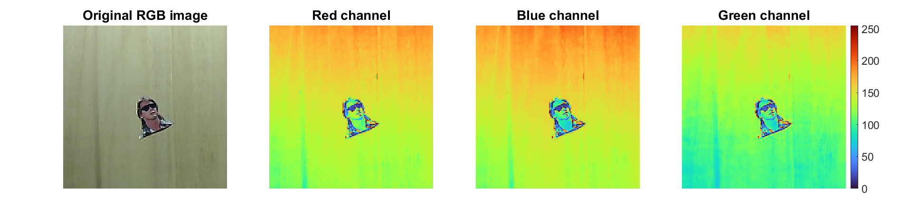

***Figure 2:** Input example: a colored image.*

</div> 

<br>

2. **Convolutional Layers** 
    
These are **the core building blocks of a CNN**. Each convolutional layer applies a set of *filters* (or *kernels*) to its input. A filter is a small tensor that *slides* (or *convolves*) across the input. At each position, the filter performs an element-wise multiplication with the portion of its input it is currently over, and then sums up the results to produce a single value in the output, and these values collectively form the **feature map**.

<div align="center">


***Figure 3:** 2D-convolution example for image sharpening. [^3]*

</div>

[^3]: Michael Plotke, [CC BY-SA 3.0](https://creativecommons.org/licenses/by-sa/3.0/ ), via Wikimedia Commons

This linear process helps to extract local features, such as edges, textures, and patterns in images applications. Typically, various filters are used simultaneously to extract different types of features. 

***Figure 4*** displays a sharpened image's channel obtained with the sharpening kernel from *figure 3*:

$$
  \begin{align*}
    H_{\text{sharp}} =
    \begin{bmatrix}
      0 & -1 & 0 \\
      -1 & 5 & -1 \\
      0 & -1 & 0 
    \end{bmatrix}
  \end{align*}
$$

Since the result is not normalized between 0 and 1, the color reference has been anchored to the output’s actual range. We observe that the sharpening kernel accentuates high-frequency components, making edges and fine details more pronounced in the result.

<div align="center">

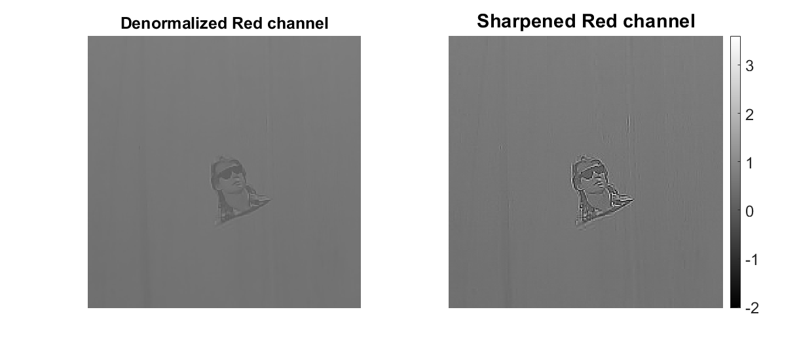

***Figure 4:** Sharpening on a single channel.*

</div>

***Figure 5*** shows edges extracted from a image's channel using a *2D Sobel kernel*:

$$
  \begin{align*}
    H_{\text{sobel}} =
    \begin{bmatrix}
      1 & 2 & 1 \\
      0 & 0 & 0 \\
      -1 & -2 & -1 
    \end{bmatrix}
  \end{align*}
$$

Convolving a channel of an RGB image with a Sobel kernel approximates the derivative of the image intensity in this channel, while applying some smoothing. In this setup, using $H_{\text{sobel}}$ directly calculates the gradient magnitude along the y-axis, highlighting horizontal edges, while using its transpose $H_{\text{sobel}}^T$ calculates the gradient magnitude along the x-axis, highlighting vertical edges. Again, since the result is not normalized between 0 and 1, the color reference has been anchored to the output’s actual range.

<div align="center">

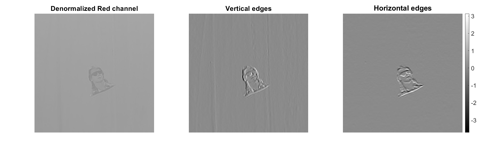

***Figure 5:** Edges exctraction on a single channel with a Sobel kernel.*

</div>

**Convolutional operations are considered lightweight** because they *reuse the same set of  weights across the entire input*, significantly reducing the number of parameters. They also leverage **local connectivity**, meaning each filter only  interacts with a small, localized region of the input at a time, allowing the network to  focus on extracting local patterns without processing the entire input at once, drastically  improving inference and training times.

Additionally, **certain convolutions can be  factorized into smaller operations** (such as depthwise separable convolutions), further  *reducing the number of computations required while maintaining empirically almost the same precision*. Convolutions  also benefit from **high parallelizability**, making them well-suited for execution on NPUs,  TPUs and GPUs. 

<br>

3. **Activation Layers** 
   
**After the convolution operation**, an activation function is applied to the feature map, to  **highlight or suppress certain previously-extracted features, introducing non-linearity into  the model.** It helps the network to better model **intricate relationships** in the data.

This step is crucial because without activation functions, the convolutional  operations would simply be linear transformations, and the network would be limited to  learning linear relationships, due to the fact that the composition of linear functions is a linear function itself.

A common activation function used in CNNs is the *Rectified Linear Unit* (*ReLU*). ReLU is  defined as $f(x) = \max(0, x)$, which means it outputs the input directly if it is positive,  otherwise, it outputs zero. Its simplicity helps keeping the architecture as lightweight as  possible.

> [!NOTE]
> While activation functions are essential, they can also lead to information loss. Functions like ReLU zero out all negative values, discarding potentially useful signals in the data, while others compress input ranges, reducing the precision of the information. This loss is a trade-off necessary for enabling networks to model complex patterns, but it can also limit the network’s ability to preserve details, which make certain patterns difficult to learn.

**Figure 6** displays the outcome of applying a ReLU activation function to a feature map  corresponding to horizontal edges.

<div align="center">

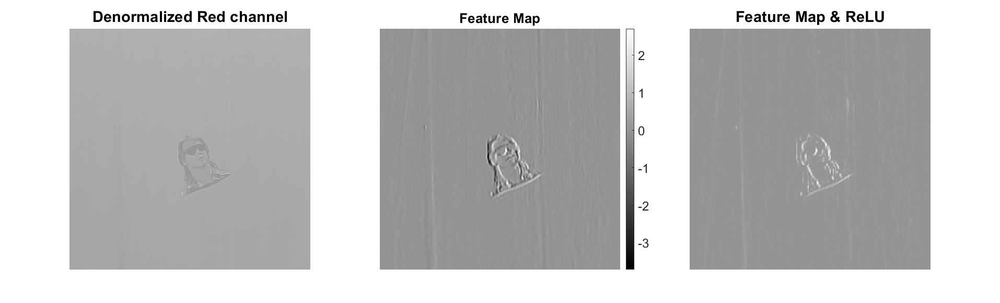

***Figure 6:** ReLU activation example.*

</div> 

<br>

4. **Pooling Layers** 
   
**Pooling layers are used to reduce the dimensions of the feature maps**, which helps to  reduce the computational complexity and control overfitting. A common type of pooling is  **max pooling**, which takes the maximum value in each predefined ($w \times h$) window of the  feature map. Pooling layers are often used to provides **downsampling**. This allows each  subsequent layer or block of layers **to focus on extracting higher-level features** from the  outputs of the previous layer or block of layers.

<div align="center">


***Figure 7:** 2x2 Max pooling example. [^7]*

</div>

[^7]: Image by [dvgodoy](https://github.com/dvgodoy/dl-visuals) / [CC BY](https://creativecommons.org/licenses/by/4.0/)

***Figure 8***  shows the result of applying 2×2 max pooling to a ReLU-activated feature map representing horizontal edges. The pooled output has a spatial resolution reduced by a factor of two compared to the original feature map.

<div align="center">

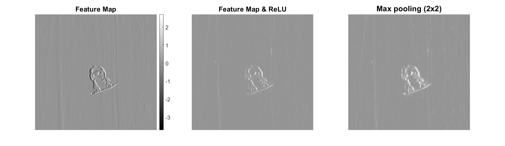

***Figure 8:** 2×2 Max pooling on feature map.*

</div> 

> [!NOTE]
> Other types of layers can be employed to reduce the resolution of feature maps, but pooling layers were very common for early CNN.

<br>

5. **Artificial neurons and Fully Connected Layers** 
   
After several convolutional and pooling layers, **the high-level reasoning is done by fully connected layers.** These layers are similar to those in a traditional neural network, where every input is connected to every output. **The fully connected layers form the classification block.** They take the *flattened feature maps* and learn to combine the detected patterns to determine what is present in the original input. **The first layer of the network always has its input size equal to the size of the flattened feature maps.** 

***Figure 9*** is a diagram representing the structure of a **single artificial neuron** used in fully connected layers, and conceptually in features extraction blocks.

- The neuron receives **multiple inputs** $x_1,\ x_2,\ \dots,\ x_i​,\ \dots,\ x_n$ ​, which can be either features  from the input data or activations from neurons in the previous layer. Each input is  multiplied by a corresponding **weight** $w_1,\ w_2,\ \dots,\ w_i​,\ \dots,\ w_n$ ​, controlling the  influence of each input on the neuron's output.

- A **bias term** ($b$) is also included in the neuron, shown as an additional input with a constant weight of 1. The bias allows the neuron to shift the activation function, improving the network’s ability to fit the data by providing additional flexibility during training.

- Inside the neuron, *the weighted inputs and bias are summed to compute the value* $z$. This step, depicted in the left half of the circle, represents the **linear aggregation process** and is mathematically defined as:


$$
  \begin{align*}
    z=\sum_{k=1}^n w_kx_k + b
  \end{align*}
$$


- After the aggregation, the value $z$ is passed through an **activation function**, which we already described, illustrated in the right half of the circle as $f$. The result of this activation is the neuron's output $y$, given by:

$$
  \begin{align*}
    y=f(z)
  \end{align*}
$$


<div align="center">

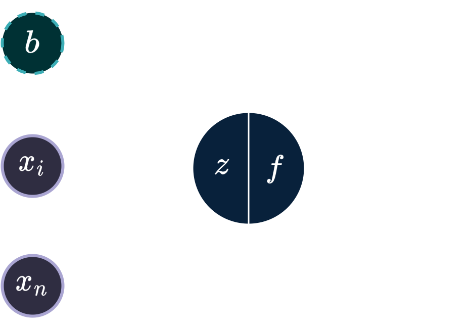

***Figure 9:** Artificial Neuron structure.*

</div> 

The output $y$ is then passed forward, either to the next layer in a multi-layer network or as the final output in a single-layer model. This structured flow — weighted input summation, bias addition, activation, and output — forms the fundamental computation block within all neural networks.

> [!NOTE]
> **In features extraction blocks**, the artificial neuron structure remains fundamental, but instead of having separate weights for each input as in fully connected layers, these layers use **weight sharing**: the same set of weights (a kernel) is applied across all spatial locations in the input, allowing the network to detect the same feature regardless of its position. Additionally, **each filter has a single bias value** that is added uniformly to all spatial positions of the resulting feature map.

<br>

6. **Output Layer** 
    
The final layer of a CNN is **the output layer, which produces the final predictions.** For a classification task, this layer often uses a *softmax* activation function to output *a probability distribution* over the different classes.

***Figure 10*** illustrates the use of a softmax activation in a classification layer. Each circle represents an artificial neuron receiving the **linear aggregation** $z$ and applying the **SoftMax activation function** across all outputs to produce normalized probabilities. Here, the network predicts three classes: `alien`, `john`, and `background`, assigning probabilities of 0.1, 0.7, and 0.2, respectively. The highest probability (0.7) corresponds to `john`, indicating that the network’s prediction for the input is `john`.

<div align="center">

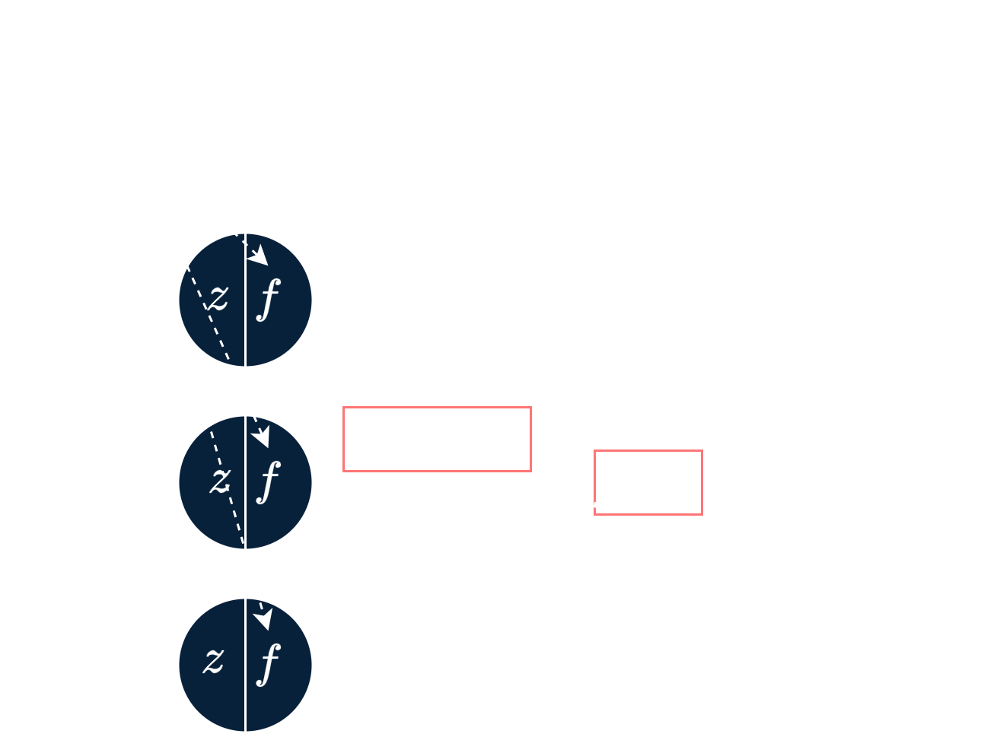

***Figure 10:** Output Layer example.*

</div> 

<br>

Thus, we described the complete constitution of a typical CNN:
  - A set of **feature-extraction blocks**, each containing *convolutional layers, activation layers and pooling layers*.
  - A **classification block** containing *fully connected layers*, with an output layer giving the model's result after a *softmax activation*.

**During training, the CNN learns the optimal values for the filters and the weights/biases in the fully connected layers.** This is done using *backpropagation* and an optimization algorithm such as *stochastic gradient descent* (*SGD*). The goal is to minimize a loss function, which measures the difference between the predicted outputs and the true labels.

While we have described a common CNN architecture, it is important to note that **contemporary research has significantly evolved CNN designs, leading to a wide variety of block and layer organizations**. CNNs are now utilized for tasks beyond classification, although **the core process remains the extraction of features from the input and the gradual reduction of feature map resolution to capture increasingly abstract features.**

#### 📐 Dimensions of CNNs

CNNs can be applied to various types of data by adapting the *dimensionality of the convolution operation* to match the structure of the input data.

- **1D CNNs** perform convolution over **one dimension**, sliding filters along a single axis of the data. Use cases are:
  - Signal processing (waveform or spectrogram channels processed as sequences).
  - Natural language processing (text sequences).

    <div align="center">

    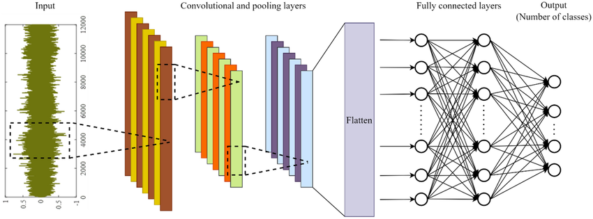

    ***Figure 11:** 1D CNN for damage detection of structures using time series data. [^11]*

    </div>

    [^11]: Tran, Viet-Linh & Cuong, Vo & Nguyen, Thi-Quynh (2023). *One-dimensional convolutional neural network for damage detection of structures using time series data*. Asian Journal of Civil Engineering. 25. 1-34. 10.1007/s42107-023-00816-w. https://www.researchgate.net/figure/General-architecture-of-1D-CNN-model_fig1_372444648  

- **2D CNNs** perform convolution over **two dimensions** (*height and width*), the standard CNN type for image and video frame processing. Use cases are:
  - Image classification.
  - Object detection.
  - Semantic segmentation.
  - Style transfer and image super-resolution.

    <div align="center">

    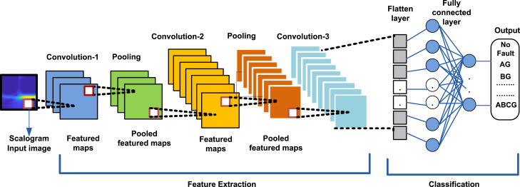

    ***Figure 12:** 2D CNN for for fault classification in transmission line. [^12]*

    </div>

    [^12]: Pravati Nayak, Shitya Ranjan Das, Ranjan K. Mallick, Sairam Mishra, Ahmed Althobaiti, Alsharef Mohammad, Flah Aymen (2024). *2D-convolutional neural network based fault detection and classification of transmission lines using scalogram images* [Computational Materials Science]. https://www.sciencedirect.com/science/article/pii/S240584402414978X  

- **3D CNNs** perform convolution over **three dimensions** (*depth, height, width*), allowing the network to learn spatiotemporal or volumetric features. Use cases are:
  - Video analysis (motion and behaviour recognition).
  - Volumetric data processing.

    <div align="center">

    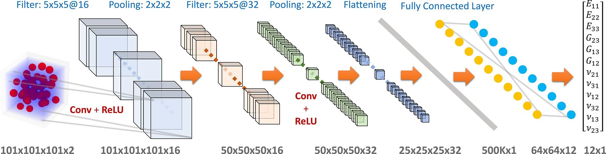

    ***Figure 13:** 3D CNN for heterogeneous material homogenization. [^13]*

    </div>

    [^13]: Chengping Rao, Yang Liu (2020). *Three-dimensional convolutional neural network (3D-CNN) for heterogeneous material homogenization* [Computational Materials Science]. https://www.sciencedirect.com/science/article/abs/pii/S0927025620303414  

#### 🖼️ Focus on 2D CNN

**2D CNNs** are the standard for image and video processing tasks (when the notion of time is not needed). Here:

- The **input is a 2D grid** (*height, width*) with channels (e.g., RGB).

- A set of **blocks** will first *extract different patterns from the input, called **features***, by aggregating them in two dimensions to build **feature maps**. These blocks are made of different **layers**:

  - **Convolutional layers:** Filters (kernels), sliding across each 2D input, computing feature maps that highlight spatial patterns in the original input image.

  - **Activation layers:** Each convolutional layer is **followed by an activation function** to build a relationship between the input data and the output feature map, by controlling the amount of activated neurons.

  - **Pooling layers:** A pooling provides *downsampling*, to reduce the spatial dimensions (height and width) of the feature maps, while retaining the most important information. This allows each subsequent layer/block to **focus on extracting higher-level features** from the outputs of the previous layer/block.

- Stacking multiple blocks allows the network to extract increasingly abstract features. This process is called **Hierarchical Feature Extraction**:
  - **Early blocks:** Detect edges, lines, corners.
  - **Intermediate blocks:** Recognize textures and shapes.
  - **Deeper blocks:** Capture object parts or high-level semantic features.

***Figure 14a*** illustrates the hierarchical feature extraction process accross the different feature-extraction blocks within **VGG16**[^14], a *lightweight CNN*. ***Figure 14b*** shows the job done within the first feature-extraction block of VGG16. Each block is composed of **two convolutional layers using 3×3 kernels**, each followed by a **ReLU activation** layer, and of a final **max pooling layer using a 2×2 pool size**.

<div align="center">

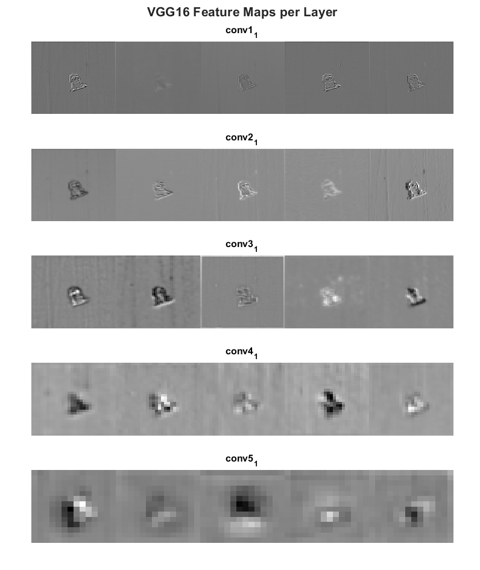

***Figure 14a:** Hierarchical Feature Extraction in VGG16 CNN accross blocks.*

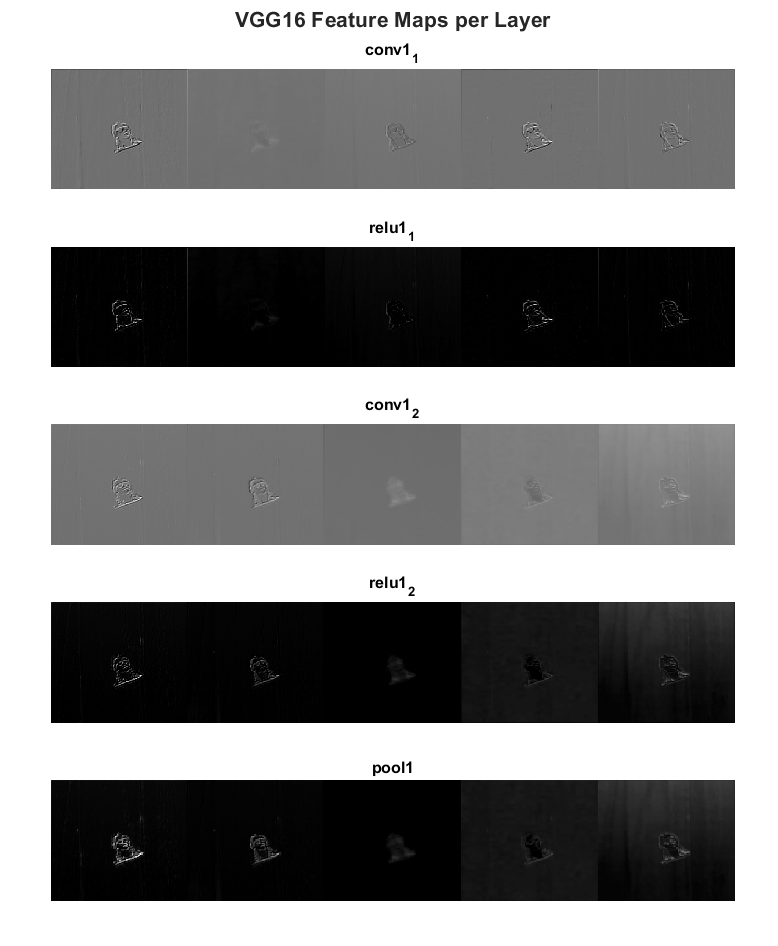

***Figure 14b:** Hierarchical Feature Extraction in VGG16 CNN, first block.*

</div>

[^14]: Karen Simonyan, Andrew Zisserman (2015). *Very Deep Convolutional Networks for Large-Scale Image Recognition* (Version 6.0.0) [cs.CV]. https://arxiv.org/abs/1409.1556

***Figure 15*** illustrates a 2D CNN as used in the LeNet-5 model for handwritten digit recognition. The output layer consists of 10 neurons, each corresponding to one of the digits from 0 to 9. The neuron with the highest activation value (ranging between 0 and 1) indicates the digit predicted by the model.

<div align="center">

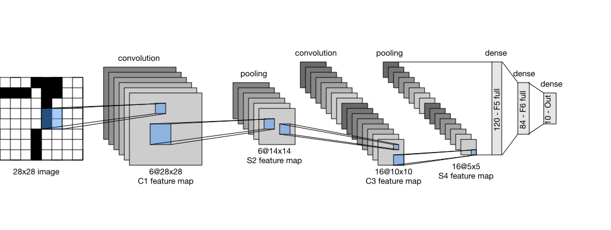

***Figure 15:** LeNet-5 model using a 2D CNN for handwritten digit recognition. [^15]*

</div>

[^15]: By Zhang, Aston and Lipton, Zachary C. and Li, Mu and Smola, Alexander J. - https://github.com/d2l-ai/d2l-en, CC BY-SA 4.0, https://commons.wikimedia.org/w/index.php?curid=152265656

Among AI models using 2D CNN, we will talk about the **MobileNetV2** classification model and the **YOLOv8n** detection model.

---

### MobileNetV2

**MobileNetV2** is a *lightweight convolutional neural network* architecture primarily **designed for classification tasks on mobile and embedded devices**, enabling visual recognition under tight computational and memory constraints with a reasonable accuracy.

Building upon **MobileNetV1’s use of depthwise separable convolutions** to reduce computation, **MobileNetV2 introduces inverted residuals and linear bottlenecks**, which allow the network to maintain good representational capacity while reducing compute and parameter count significantly. This design enables MobileNetV2 to operate in real-time on-device while preserving reasonable accuracy with much larger models.

> [!NOTE]
> MobileNetV2 can be used as a base to build a detection network.

#### 🛠️ Technical Review: Issues Addressed and Architecture

**I. ReLU collapsing issue**

In traditional CNNs, the **feature extraction block** typically consists of *convolutional layers followed by non-linear activation functions* (like ReLU) and sometimes pooling layers to progressively extract and compress features before passing them to the fully connected classification block, as we covered in the previous sections.

However, **MobileNetV2 identifies a critical issue in this design when using non-linearities like ReLU in compressed, low-dimensional feature spaces.** When the output of a convolutional layer is very low-dimensional, applying ReLU can zero out important information, effectively **losing essential features that the network needs for accurate classification.**

***Figure 16*** is a rework from the document [MobileNetV2: Inverted Residuals and Linear Bottlenecks](https://arxiv.org/pdf/1801.04381)[^1]. In these examples the initial spiral is embedded into a n-dimensional space using random matrix $T$ followed by ReLU activation, and then projected back to the original 3D space using $T^{−1}$. In examples above, $n = 3$ to $10$ result in information loss where certain points of the manifold collapse into each other, while for $n = 15$ to $30$ the transformation is highly non-convex, with a preservation of the original structure.

<div align="center">

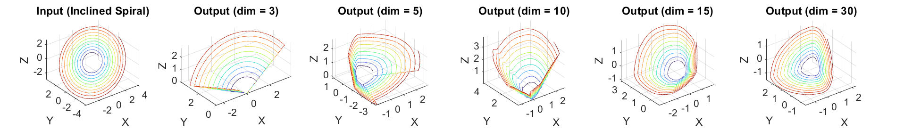

***Figure 16:** Examples of ReLU transformations of low-dimensional manifolds embedded in higher-dimensional spaces.*

</div>

> **Manifold Hypothesis** 
> 
> This hypothesis suggests that high-dimensional data often lies on or near *a lower-dimensional manifold*, called *manifold of interest*. This means that even though the data might be represented in a high-dimensional space, the intrinsic dimensionality (the number of degrees of freedom) could be much lower.

The team working on MobileNetV2 shows that **if the input data can be embedded into a significantly lower-dimensional subspace of the activation space** then the **ReLU transformation preserves the information** while introducing the needed complexity into the set of expressible functions.

Thus, MobileNetV2 introduces **linear bottlenecks**. Instead of applying ReLU after the layer that reduces dimensionality (the bottleneck layer), MobileNetV2 uses *no activation (no ReLU) at the output of these compressed representations*, **ensuring that information is preserved**, and apply *ReLU activation only on representations with expanded channels dimensions*.

<br>

**II. Computational optimizations**

Another key innovation is the use of **inverted residual blocks**, which modify the classic idea of residual (or skip) connections found in many CNN architectures. In traditional residual blocks, skip connections bypass a series of convolutional layers by adding the input feature map directly to the output of these layers, usually across **wide, high-dimensional feature spaces.** Mathematically, this can be expressed as:

$$
\begin{align*}
  y=F(x)+x
\end{align*}
$$

where $x$ is the input, $F(x)$ is the output of convolutional layers, and $y$ is the block output. This bypass helps **preserving information** that might otherwise be lost or distorted through multiple convolution and activation layers, and helps **improving gradient flow** during traning's backpropagation process, by mitigating the *vanishing gradient problem*.

In contrast, MobileNetV2 applies these skip connections **across the narrow, low-dimensional bottleneck layers** instead, which **improves computational efficiency** by performing the addition on smaller feature maps, **reduces memory usage**, and **still maintains effective gradient flow and feature reuse.**

<br>

**III. MobileNetV2 Innovations in a Nutshell**

Here is a simplified version of how an inverted residual block with linear bottleneck works, step-by-step:

1. **Expansion:** The low-dimensional $h × w × k$ input $x$ (with $k$ channels) is expanded by a factor $t$ (usually 6) using 2D convolution with a 1×1 kernel and a ReLU6 activation function, increasing the channel dimension to $k\times t$:

$$
\begin{align*}
  x_{\text{exp}}=(\mathrm{ReLU6} \circ \mathrm{conv2D_{1\times 1}}) (x)
\end{align*}
$$

2. **Depthwise convolution:** A depthwise convolution with a 3×3 kernel is applied to $x_{\text{exp}}$​ followed by ReLU6 activation to capture spatial features. Note that a *stride* hyperparameter $s$ (usually 1 or 2) can be introduced to reduce the spatial resolution of $x_{\text{exp}}$ from $h × w$ to $\frac{h}{s} × \frac{w}{s}$.

$$
\begin{align*}
  x_{\text{dw}}=(\mathrm{ReLU6} \circ \mathrm{convDW_{3\times 3}^{(s)}}) (x_{\text{exp}})
\end{align*}
$$

3. **Projection:** The expanded features $x_{\text{dw}}$​ are then projected back to $k'<k$ channel dimension with a 2D convolution and 1×1 kernel, **without activation** (fully linear):

$$
\begin{align*}
  y=\mathrm{conv2D_{1\times 1}} ( x_{\text{dw}})
\end{align*}
$$

4. **Skip connection:** If the input and output shapes match, the input $x$ is added to $y$. Thus, the output $z$ can be computed:

$$
\begin{align*}
  z=
  \begin{cases}
    x+y & \text{if} \ \mathrm{shape}(x)=\mathrm{shape}(y) \\
    y  & \text{otherwise}
  \end{cases}
\end{align*}
$$

<br>

<div align="center">

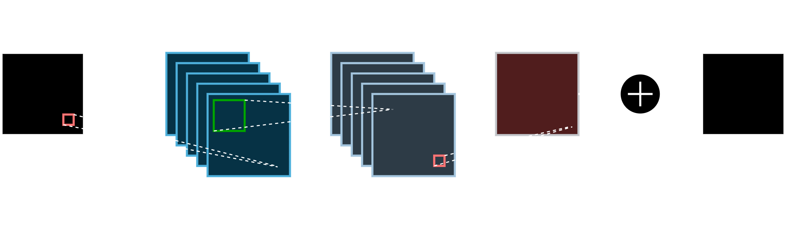

***Figure 17:** MobileNetV2's "Bottleneck" feature extraction block with stride 1.*

</div>

<br>

#### ✅ In a Nutshell

MobileNetV2 retains the familiar CNN structure of:

- Input layer
- Feature extraction blocks
- Classification layers (fully connected network)
- Output layer

but reimplements traditional feature extraction blocks with **depthwise separable convolutions**, **linear bottlenecks** to preserve information, and **inverted residual connections** to maintain gradient stability and efficiency.

#### 📊 Benchmark Results: ImageNet Classification

On the **ImageNet**[^17] classification benchmark [^1], MobileNetV2 demonstrates good performance with lower compute and parameter count compared to MobileNetV1 while improving accuracy and inference speed, obtained here with 224×224 input images using a Google Pixel 1 phone and TF-Lite format.

| **Model**       | **Top-1 Accuracy** | **Parameters** | **MAdds** | **Inference time (CPU)** |
| --------------- | ------------------ | -------------- | --------- | ------------------------ |
| MobileNetV1     | 70.6%              | 4.2M           | 575M      | 143 ms                   |
| **MobileNetV2** | **72.0%**          | **3.4M**       | **300M**  | **75 ms**                |

[^17]: Olga Russakovsky, Jia Deng, Hao Su, Jonathan Krause, Sanjeev Satheesh, Sean Ma, Zhiheng Huang, Andrej Karpathy, Aditya Khosla, Michael Bernstein, Alexander C. Berg, Li Fei-Fei (2015). *ImageNet*. https://www.image-net.org/index.php

---

### YOLOv8n

> [!WARNING]
> **As of June 2025, there is no official publication detailing YOLOv8’s architecture.**

**YOLO (You Only Look Once)** is a family of real-time object detection models that frame detection as a **single-stage regression problem**, predicting bounding box coordinates and class probabilities in one forward pass through the network. This design enables YOLO models to achieve high detection speeds while maintaining strong accuracy.

Since YOLOv1, each iteration has made a bunch of improvements. Released by *Ultralytics* in 2023, **YOLOv8** comes with:
- **Anchor-free detection:** Simplifies bounding box prediction by directly regressing box centers and sizes without predefined anchor boxes.
- A *modular architecture* with a **backbone (feature extraction), neck (feature fusion), and decoupled detection head (box and class prediction)**, making it scalable and easy to adapt across tasks (detection, classification, segmentation).
- Support for **dynamic input shapes**, data augmentation and improved training strategies.

YOLOv8 comes in multiple model sizes (**Nano, Small, Medium, Large, XLarge**) that adjust depth and width to match computational constraints while retaining the same modular design. **YOLOv8n** (**Nano**) is the lightest variant of YOLOv8, optimized for low-latency inference on CPUs and edge devices with:
 - **Minimal parameter count**
 - **Low FLOPs**
 - **Fast inference speeds**

#### 💡 How does YOLO algorithm works

**I. Single-stage Regression**

Modern object detection models can be grouped into **two main paradigms**: *two-stage* and *single-stage* detectors.

**Two-stage detectors** work in two steps:

1. **Region Proposal:** They first generate candidate regions that might contain objects.
2. **Refinement:** They then run a classifier (and bounding box regressor for detection) on each region to refine its position and predict its class. A CNN is commonly used to extract features from each region.

This process is accurate but computationally expensive, since the input image is inspected multiple times. Also, the two parts are likely to be trained separately.

**YOLO**, in contrast, uses a **single-stage** approach: the entire image is passed through the network once, which **directly predicts** bounding box coordinates and class probabilities in a single forward pass:

- The network divides the **image into a $s \times s$ grid**.
- From these cells the model computes a **set of bounding boxes & confidences scores**, as well as a **class probability map**.
- **These information are finally combined** to apply the bounding boxes to the identified objects with their confidence score.

This design drastically reduces inference time, and only one model has to be trained for the complete task. Since the YOLO's architecture is modular, the process can be adapted for segmentation or angle detection tasks.

**II. Anchor-free Detection**

Earlier YOLO versions used **anchor boxes** — *predefined bounding box shapes and sizes* — to match predicted boxes to ground truth during training. While effective, anchors add complexity:

- You must manually tune anchor sizes.
- Predictions are constrained by anchor shapes.

YOLOv8 replaces this with an **anchor-free** design: the decoupled detection head outputs **class probabilities, objectness scores, and box coordinates** without relying on predefined anchor shapes. This makes training simpler, reduces hyperparameter tuning, and supports flexible object scales naturally.

**III. 🔥 Inference Example**

Let take the following 224×224 image as an input example.

<div align="center">

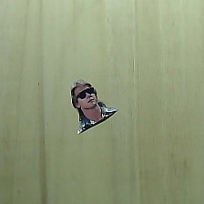

***Figure 18:** 224×224 Input image.*

</div>

During training, the model was provided with images containing various object classes along with the corresponding bounding box data and labels for each object. **These reference boxes are known as ground truth boxes.**

The input image is first divided into cells with a $s \times s$ grid. **If the center of a ground truth box**
$\mathrm{box_{gt}}$
**falls into a grid cell, that grid cell is assigned to**
$\mathrm{box_{gt}}$. By doing so, a cell is responsible for predicting objects whose centers fall inside it.

**For each cell**, the following elements are computed:

- **Class probabilities vector $\mathbf{p}$:** Each grid cell predicts the potential object's classes. For a model trained to recognize $n$ classes, $\mathbf{p}$ is a vector where the $i^{\text{th}}$ row is the conditional class probability of having an object $o$ of class $c_i$, noted $p(c_i | o)$.

$$
\begin{align*}
  \mathbf{p} =
  \begin{bmatrix}
    p(c_1 | o) \\
    \vdots \\
    p(c_i | o) \\
    \vdots \\
    p(c_C | o)
  \end{bmatrix}
\end{align*}
$$

- **Bounding Box vectors $\mathbf{b}_j$:** Each grid cell predicts $m$ bounding boxes and a confidence score for each. Each predicted bounding box is actually associated to a vector of 5 predictions. For the $j^{\text{th}}$ bounding box $\text{box}_j$, this vector  $\mathbf{b}_j$ contains $x_j$ and $y_j$ the center coordinates of the box relative to the bounds of the grid cell, $w_j$ and $h_j$ its width and height relative to the whole image, and $C_j$ its confidence score.

$$
\begin{align*}
  \mathbf{b}_j =
  \begin{bmatrix}
    x_j \\
    y_j \\
    w_j \\
    h_j \\
    C_j
  \end{bmatrix}
\end{align*}
$$

***Figure 19*** illustrates a bounding box $\text{box}_j$ of dimension $h\times w$ inside an image of dimension $H\times W$. The center of $\text{box}_j$ is inside a cell of dimension $s\times s$. Thus:

$$
\begin{cases}
  x_j&=&y/s\\
  y_j&=&x/s\\
  h_j&=&h/H \\
  w_j&=&w/W
\end{cases}
$$

<div align="center">

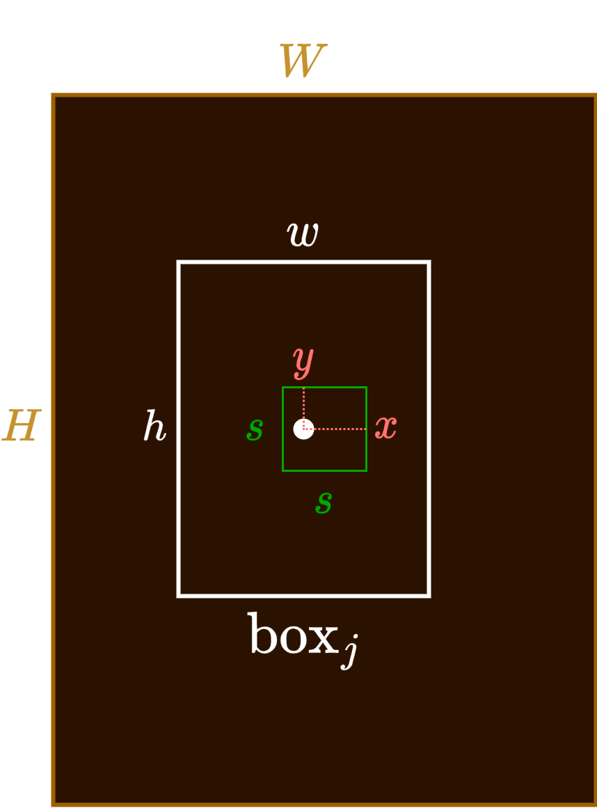

***Figure 19:** Bounding box representation.*

</div>

For a single cell, the predictions are encoded as a vector of dimension $m\times 5 + n$, giving a prediction tensor of shape $s\times s\times(m\times 5 + n)$ for the whole image. Here is an example representing the predictions on the input images.

<div align="center">

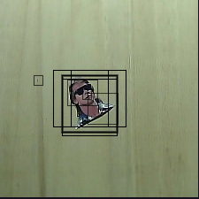

***Figure 20a:** Example for predicted bounding boxes and confidence scores.*


***Figure 20b:** Example for predicted classes.*

</div>

The confidence score $C_j$ associated with $\text{box}_j$, is defined as the product of the probability of having an object $o$ in $\text{box}_j$, $p(o)$, and the **Intersection Over Union** (**IoU**) between
$\text{box}_j$ and the ground truth box $\text{box}\_{\text{gt}}$ associated to the cell. It reflects how confident the model is that the box contains an object and also how accurate it thinks the box is that it predicts.[^18]

[^18]: Joseph Redmon, Santosh Divvala, Ross Girshick, Ali Farhadi (2015). *You Only Look Once: Unified, Real-Time Object Detection* (version 5.0.0) [cs.CV]. https://arxiv.org/pdf/1506.02640

```math
C_j = p(o) \times \text{IoU}(\text{box}_j,\,\text{box}_{\text{gt}})
```

The IoU between $\text{box}_j$ and $\text{box}\_{\text{gt}}$ is calculated as the area of the intersection of the two boxes $S(\text{box}_j \cap \text{box}\_{\text{gt}})$ divided by the area of their union $S(\text{box}_j \cup \text{box}\_{\text{gt}})$.

```math
\text{IoU}(\text{box}_j,\,\text{box}_{\text{gt}}) = \frac{S(\text{box}_j \cap \text{box}_{\text{gt}})}{S(\text{box}_j \cup \text{box}_{\text{gt}})}
```

</div>

<div align="center">

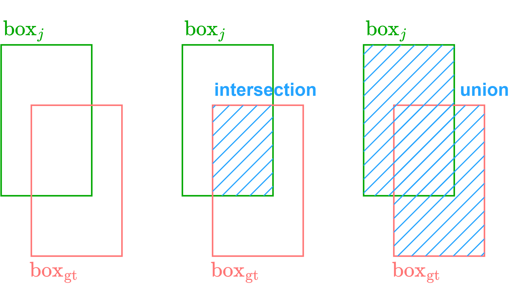

***Figure 21:** IoU representation.*

</div>

Then each bounding box $\text{box}_j$ is associated to class-specific confidence scores by multiplying the conditional class probabilities $p(c_i | o)$ and the individual box confidence predictions $C_j$. These scores encode both the probability of that class appearing in the box and how well the predicted box fits the object.[^18]

Lastly, for each cell, only the bounding boxes with a class-specific confidence score above a specified threshold value $t$ are retained. The final bounding box for this cell is the one with the best class-specific confidence score. This process is called **Non-Maximum Suppression** (**NMS**).

</div>

<div align="center">

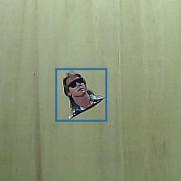

***Figure 22:** YOLO output.*

</div>

#### 🛠️ Modular Architecture

YOLOv8n's architecture is divided into three parts, each performing a special role in the whole detection pipeline:

- **Backbone:** extracts multi-scaled features from the input.
- **Neck:** combines these features together and precondition them.
- **Head:** performs classification and detection from the Neck-processed features.

</div>

<div align="center">


***Figure 23:** YOLOv8n architecture, inspired by [^21].*

</div>

[^21]:  Priyanto Hidayatullaha, Nurjannah Syakranib, Muhammad Rizqi Sholahuddinc, Trisna Gelard, Refdinal Tubaguse (2025) *YOLOv8 to YOLO11: A Comprehensive Architecture In-depth Comparative Review* (Version 2.0.0) [CS.cv]. https://arxiv.org/pdf/2501.13400

**I. Backbone**

YOLOv8 uses a customized CSPDarknet-style CNN backbone. The main blocks constituing the CNN are **Conv** blocks and **C2f** blocks.

**a. Conv**

Conv (**Convolutional**) blocks are made of:

- A set of **2D convolutional** layers,
- A set of **2D batch normalization** layers,
- A set of activation layers using **SiLU** as activation function.

**2D batch normalization** (**BatchNorm2D**) layers [^19] are employed to achieve a stable distribution of activation values
throughout training by reducing internal covariate shift.

</div>

<div align="center">


***Figure 24:** YOLOv8n's Conv block, inspired by [^21].*

</div>

Let $h$ and $w$ denote the height and width of the input feature maps, $k$ the number of channels, and $n$ the batch size. For a given channel $c$, the output $y_c$​ of the batch normalization layer is computed from its input $x_c$​, using the mean and variance calculated over all pixels in channel $c$ across the entire batch. 

$$
\begin{align*}
  y_c=\frac{x_c-\mathbb{E} (x_c)}{\sqrt{\mathbb{V} (x_c) + \varepsilon}}\times \gamma_c + \beta_c
\end{align*}
$$

Where $\gamma_c$ and $\beta_c$ are learnable weight and bias for channel $c$ and $\varepsilon$ is a small constant to avoid division by zero.

[^19]: Sergey Ioffe, Christian Szegedy (2015). *Batch Normalization: Accelerating Deep Network Training by Reducing Internal Covariate Shift* (Version 3.0.0) [cs.LG]. https://arxiv.org/pdf/1502.03167

**b. C2f**

C2f (**Concatenate to fuse**) blocks use the same principle seen in *MobileNetV2*, that is a **channel expansion followed by multiple linear bottleneck layers with shortcuts (skip connections), and a channel projection**, to extract features from the input.

The difference resides in the fact that the expanded input features are evenly divided into two tensors of equal shape using a **Split** layer along the channel dimension, and outputs from all bottlenecks are concatenated together with the previously split input using a **Concat** (concatenation) layer along the channel dimension, before being projected back together. This process has several advantages:

- **Concatenating** the outputs of multiple operations results in a **dense feature representation** that combines information from different receptive fields and levels of abstraction.
- **Splitting** can help improve the flow of gradients during backpropagation, like a shortcut does in a residual block.

The height and width are preserved across the whole C2f block.

</div>

<div align="center">

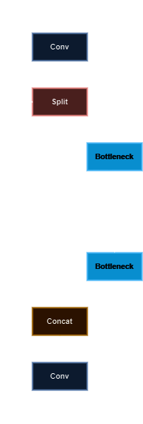

***Figure 25:** YOLOv8n's C2f block, inspired by [^21].*

</div>

Thus:

- The stem begins with two **Conv** blocks to reduce resolution quickly while forming initial features.
- Across **8 stages**, alternating **Conv** blocks and repeated **C2f** blocks capture hierarchical features.
- The backbone outputs three scales of feature maps, with decreased resolutions, progressively capturing different levels of features. They are used as shortcuts between the backbone and the neck to improve training performances.

**II. Neck**

The neck is responsible for fusing and preparing multi-scale feature maps for detection. The main used blocks are an **SPPF** block, **C2f** blocks with no shortcuts, **Upsample** blocks and **Concat** blocks.

**a. SPPF**

The SPPF (**Spatial Pyramid Pooling Fast**) block is an optimized version of the Spatial Pyramid Pooling (SPP) block [^20]. A core limitation in standard CNN architectures is the requirement for **fixed-size** input images. This **constraint is imposed by the fully connected layers**, which expect input vectors of a consistent size. As a result, input images must be **cropped** or **warped** to a predetermined size, which can lead to **loss of important content or introduce geometric distortions**.

SPP is introduced as a method to eliminate the fixed-size constraint of CNNs. Unlike traditional pooling, which operates on fixed-sized regions, **SPP partitions the convolutional feature maps into a set of spatial bins in a pyramid fashion** (e.g., 1×1, 2×2, 4×4). These spatial bins have sizes proportional to the image size, so the number of bins is fixed regardless of the image.

**Each bin pools the response of each filter of the last convolutional layer.** The outputs of the spatial pyramid pooling are $(f\times b)$-dimensional vectors, with $b$ the number of bins and $f$ is the number of filters in the last convolutional layer.

In YOLOv8n, SPPF uses max pooling layers with 3×3, 5×5 and 9×9 pool sizes.

[^20]: Kaiming He, Xiangyu Zhang, Shaoqing Ren, Jian Sun (2015). *Spatial Pyramid Pooling in Deep Convolutional Networks for Visual Recognition* (Version 4.0.0) [cs.CV]. https://arxiv.org/pdf/1406.4729

</div>

<div align="center">

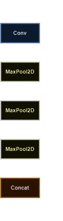

***Figure 26:** YOLOv8n's SPPF block, inpired by [^21].*

</div>

**b. Upsample**

Upsampling layers **increase the height and width of feature maps**, *without the need of learning new parameters, while preserving the feature structure*. The **nearest neighbor upsampling technique** is used by YOLOv8n: the newly created pixels are filled with the values of neighboring pixels.

Upsampling layers **allow lower-resolution semantic features from deeper layers to align with higher-resolution features from earlier layers**, when concatenated via shortcuts.

**III. Head**

The head interprets the fused features to predict bounding boxes, object classes, and confidence scores, finalizing the detection process.

- Decoupled, anchor-free head:
  - YOLOv8 separates classification and regression tasks into separate branches, reducing task interference time.
  - There are **three separate detection heads**, connected to *three different feature map scales*:
    - **Head‑small**: from the third neck output for small objects,
    - **Head‑medium:** from the middle scale,
    - **Head‑large:** from the last scale for large objects
  - Each detection head typically consists of convolutional layers that outputs bounding box coordinates, class logits, and confidence scores.

#### ✅ In a Nutshell

YOLOv8n is the smallest variant of the YOLOv8 family by Ultralytics, optimized for low-latency inference on edge devices. Like all YOLO models, it treats object detection as a single-stage regression problem, enabling real-time performance.

- **🔍 Key Features**
  - **Anchor-free detection:** Simplifies training by removing predefined anchor boxes.
  - **Modular architecture:** Composed of a Backbone, Neck, and Detection Head.
  - Dynamic input shapes, data augmentation, and improved training strategies.
- **🧠 How YOLO Works**
  - **1. Single-stage Regression:**
    - Divides input image into an $s \times s$ grid.
    - Each grid cell predicts:
      - Class probabilities.
      - Bounding box coordinates and confidence score.
  - **2. Anchor-free Head:**
    - Eliminates complexity and manual tuning of anchor boxes.
  - **3. Inference Pipeline:**
    - Predictions with low confidence are filtered out.
    - Non-Maximum Suppression (NMS) selects the best bounding boxes.
- **🏗️ Modular Architecture**
  - **I. Backbone (Feature Extraction):**
    - Based on CSPDarknet with:
      - **Conv** blocks (Conv2D + BatchNorm + SiLU).
      - **C2f** blocks: Efficient feature fusion via split and concatenate.
  - **II. Neck (Feature Fusion):**
    - **SPPF** block (Spatial Pyramid Pooling Fast): Captures multi-scale context via pooling with 3×3, 5×5, 9×9 kernels.
    - Nearest neighbor **upsampling**: Efficiently increases resolution without extra parameters for feature preparation.
    - **C2f** and **Concat** blocks: Fuse backbone features for detection.
  - **III. Head (Prediction):**
    - *Decoupled detection heads for*:
      - Classification,
      - Box regression and confidence score.
    - *Three scales*: for detecting small, medium, and large objects.

#### 📊 Benchmark Results: ImageNet Classification

Here is the **ImageNet**[^17] classification benchmark [^16] for multiple sizes of YOLOv8, with 224×224 input images, on an [Amazon EC2 P4d](https://aws.amazon.com/fr/ec2/instance-types/p4/) instance and using ONNX format.

| Model       | Top-1 Accuracy (%) | Parameters (M) | FLOPs (G) | CPU Inference Time (ms) |
| ----------- | ------------------ | -------------- | --------- | ----------------------- |
| **YOLOv8n** | **69.0**           | **2.7**        | **0.5**   | **12.9**                |
| YOLOv8s     | 73.8               | 6.4            | 1.7       | 23.4                    |
| YOLOv8m     | 76.8               | 17.0           | 5.3       | 85.4                    |
| YOLOv8l     | 76.8               | 37.5           | 12.3      | 163.0                   |
| YOLOv8x     | 79.0               | 57.4           | 19.0      | 232.0                   |

[^16]: https://docs.ultralytics.com/fr/models/yolov8/#performance-metrics

#### 📊 Benchmark Results: COCO Detection

Here is the **COCO**[^18] detection benchmark [^16] for multiple sizes of YOLOv8, with 640×640 input images, on an [Amazon EC2 P4d](https://aws.amazon.com/fr/ec2/instance-types/p4/) instance and using ONNX format.

| Model       | mAP (50-95) (%) | Parameters (M) | FLOPs (G) | CPU Inference Time (ms) |
| ----------- | --------------- | -------------- | --------- | ----------------------- |
| **YOLOv8n** | **37.3**        | **3.2**        | **8.7**   | **80.4**                |
| YOLOv8s     | 44.9            | 11.2           | 28.6      | 128.4                   |
| YOLOv8m     | 50.2            | 25.9           | 78.9      | 234.7                   |
| YOLOv8l     | 52.9            | 43.7           | 165.2     | 375.2                   |
| YOLOv8x     | 53.9            | 68.2           | 257.8     | 479.1                   |

[^18]: Tsung-Yi Lin, Michael Maire, Serge Belongie, Lubomir Bourdev, Ross Girshick, James Hays, Pietro Perona, Deva Ramanan, C. Lawrence Zitnick, Piotr Dollár (2015). *Microsoft COCO: Common Objects in Context* (Version 3.0.0) [cs.CV]. https://arxiv.org/abs/1405.0312

---

### TLDR - CNN

**Convolutional Neural Networks** (**CNNs**) are *deep learning models* designed for processing grid-like data, especially images, to perform tasks such as classification and detection. A CNN mainly consists of two parts: convolutional layers, and fully-connected layers that follow.

**Convolutional layers** apply filters (or kernels) over the input in a sliding-window fashion, producing feature maps that capture various characteristics of the input — such as edges, shapes, and textures in images. As the network goes deeper, these layers reduce the spatial dimensions of the feature maps, allowing the model to extract increasingly abstract and high-level features.

The **fully connected layers** then take these abstracted features, interpret them as parts of a larger pattern, and perform the final classification or detection task.

During **training**, a CNN *learns the optimal weights and biases* in both convolutional and fully connected layers by **minimizing a loss function**, which measures the difference between the predicted output and the actual known target. This optimization is performed through **backpropagation** and **gradient descent**.

Many CNN architectures have been proposed to refine the foundational concepts by reconfiguring or enhancing layer structures. For instance, *MobileNetV2* focuses on efficiency through the use of **depthwise separable convolutions**, **linear bottlenecks**, and **inverted residual blocks**. Modern models like *YOLOv8* build upon this evolving knowledge by incorporating advanced techniques such as **residual connections throughout the CNN backbone and detection head** using **spatial pyramid pooling** and feature fusion modules with **upsampling layers**, and an **anchor-free** detection approach.

These innovations aim to strike an optimal balance between **accuracy**, **speed**, and **resource efficiency**, making them well-suited for *real-time object detection on edge devices*.

## 🏃 Requirements to Train a Model

In this section, we focus on the training workflow for models that handle 2D inputs, specifically images, where the concept of time is not required.

### Training Basics

During training, the model aims to **determine the optimal weights and biases by minimizing a loss function**, which is a measure of how far the model's predictions are from the actual values. But how does this process actually work? Let’s explore some of the fundamental concepts that are part of the model training pipeline.

#### 📍 Idea

During training, the model is fed with various labeled images. For each image, the model makes a prediction: the input is passed through the network in what is known as a forward pass, and the model generates an output based on its specific task, such as classification or detection. However, since the model's weights and biases are not yet optimized, the prediction is often far from the actual label.

To address this, **we need a method to assess how incorrect the model’s output is and guide it on how to adjust its parameters**, so it can *make better predictions for future images*, that is how to **make the model learning.**

The explanations given in the next subsections are mainly taken from the excellent YouTube channel [^22].

[^22]: 3Blue1Brown YouTube channel (2025). https://www.youtube.com/@3blue1brown

#### ⚡Example

To illustrate, let us consider a simple inline neural network, with one neuron per layer.

</div>

<div align="center">

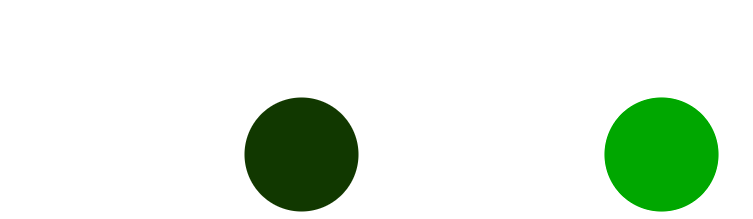

***Figure 27:** A simple neural network, inspired by [^22].*

</div>

We denote **the activation of the neuron in layer $l$** as $a^{(l)}$, which is related to $a^{(l-1)}$, the activation of the neuron in the preceding layer, by the following expression:

$$
\begin{align*}
  a^{(l)} = f(w^{(l)}a^{(l-1)} + b^{(l)})
\end{align*}
$$

where $w^{(l)}$ and $b^{(l)}$ are the **weight** and **bias** applied to the connection of the neuron in layer $l$, and $f$ is the **activation function**. To simplify, we assume that the same activation function is used across the different layers. Let us decompose the previous equation with an intermediate variable for simplification:

$$
\begin{cases}
  a^{(l)} = f(z^{(l)}) \\
  z^{(l)} = w^{(l)}a^{(l-1)} + b^{(l)}
\end{cases}
$$

Finally, let us consider a fully connected network of $L$ layers that is able to make $P$ predictions.

</div>

<div align="center">


***Figure 28:** A simple fully-connected network, inspired by [^22].*

</div>

Now the activation of a neuron depends on the weighted sum of all the activations in the previous layer plus a bias. Thus for the $n^{\text{th}}$ neuron of a layer $l$:

$$
\begin{cases}
  \displaystyle a_{n}^{(l)} = f(z_{n}^{(l)}) \\
  \displaystyle z_{n}^{(l)} = \sum_{m=1}^{M} w_{nm}^{(l)}a_{m}^{(l-1)} + b_{n}^{(l)}
\end{cases}
$$

where $M$ is the  number of activations in the previous layer.

> [!NOTE]
> **At the beginning of the training, all weights and biases are random values.**

#### 📉 Loss Function

The implementation of **the loss function** may vary between the models, but its purpose remain to quantify the error between the model's prediction and the desired output, for each training iterations. We will use the *squared error loss* (*SEL*), as it is a simple and common computing approach.

Let us start with a simple inline neural network. For a given input, which is a single training example such as one image from the training dataset, the SEL value $\lambda$ between the prediction $a^{(L)}$, output of the last layer $L$, and the desired output $y$, is given by:

$$
\begin{align*}
  \lambda = (a^{(L)} - y)^2
\end{align*}
$$

Thus, the SEL is a function of $a^{(L)}$, which in turn depends on $w^{(L)}$, $b^{(L)}$, and $a^{(L-1)}$. If there is another neuron behind, $a^{(L-1)}$ is a function of $w^{(L-1)}$, $b^{(L-1)}$, and $a^{(L-2)}$, and so on. Therefore, **the SEL is a function of all the network's weights and biases.**

Now for a fully connected network of $L$ layers that is able to make $P$ predictions, the SEL value related to the $p^{\text{th}}$ prediction on a a single training example becomes:

$$
\begin{align*}
  \lambda_p = (a_p^{(L)} - y_p)^2
\end{align*}
$$

The loss for a single training example $t$ is a scalar value obtained from the components $\lambda_p^{(t)}$, that are the $\lambda_p$ obtained for the training example $t$: 

$$
\begin{align*}
  \lambda_p^{(t)} = ([a_p^{(L)}]_t - y_p)^2
\end{align*}
$$

where $[a_p^{(L)}]_t$ is the activation of the prediction $p$ for the training example $t$.
A common approch is to take the sum of all $\lambda_p^{(t)}$ over $P$.

$$
\begin{align*}
  S_{\lambda}^{(t)} = \sum_{p=1}^P \lambda_p^{(t)}
\end{align*}
$$

To gain a comprehensive understanding of how the model predicts different classes, the final loss value should ideally be computed over the entire dataset. However, this is often very computationally expensive and impractical. Thus, the global loss function is often computed on a smaller amount of images, called a batch: at the begining, the training dataset is shuffeled and speparated in batches of same size.

The loss for a training batch containing $I$ images is obtained from $I$ single training example losses. One could take the average of all single losses over $I$. In our case:

$$
\begin{align*}
  \overline{S_{\lambda}} = \frac{1}{I} \sum_{t=1}^I S_{\lambda}^{(t)}
\end{align*}
$$

For each batch, **the goal is to minimize $\overline{S_{\lambda}}$ to reduce the errors, thus to make better predictions on the next batch.** When all batches are completed, the model has made predictions on the whole dataset. This is called an **epoch**. The average loss on an epoch can be computed. Usually, the model is trained over a certain amount of epochs, and the goal is obviously to minimize the average loss between each epoch.

***Figure 29*** is a representation of what a loss function $\overline{S_{\lambda}}(w,b)$ could look like. As it can be seen, this function has multiple minima.

</div>

<div align="center">


***Figure 29:** Loss function representation with two parameters.*

</div>

Let us see what mechanisms are used to minimize the loss function.

#### 🎢 Gradient Descent

**Minimizing the loss function means finding its lowest possible value.** This process is often straightforward for simple functions, such as polynomials with a few parameters, especially since the loss is typically positive. By computing the derivative with respect to each parameter and identifying where it equals zero, we can locate potential extrema. The sign of the derivative around these points then indicates whether they are minima or maxima.

However, as discussed in the previous subsection, **real-world loss functions often involve thousands of parameters, making both the function itself and its derivatives computationally intensive.** Additionally, such functions **can contain many local minima**, as illustrated in ***Figure 29***, meaning there is no guarantee of finding the global minimum. Since all weights and biases are random at the start of training, the initial outputs are likely to be random as well, so we do not know what the function looks like.

A more practical approach is to start at a point on the loss function and determine the direction in which to move in order to decrease the current output. For instance, consider a loss function $\overline{S_{\lambda}}(x)$ (with a single parameter). We can calculate the local slope of the loss function, i.e., its derivative $\frac{\mathrm{d}\overline{S_\lambda}}{\mathrm{d}x} \Bigr \rfloor_{x_0}$ at a given starting point $x_0$. If the slope is positive, we decrease $x_0$; if it is negative, we increase $x_0$. Repeating this process while choosing an appropriate step size to adjust the parameter helps in finding a local minimum of the function. This method is illustrated in ***Figure 30***.

</div>

<div align="center">


***Figure 30:** Finding the local minimum with the local slope.*

</div>

Now, let us take an example with a loss function $\overline{S_\lambda}(x_1,x_2,\dots,x_K)$ with $K\in \mathbb{N}^*$ parameters, that could be the weights $w_{nm}^{(l)}$ and biases $b_{n}^{(l)}$. Remember that the result of the loss function is a scalar. **By applying the previous reasonning, we can compute the gradient of the loss function**
$\mathbf{\nabla_{P_0}} \overline{S_\lambda}\in \mathbb{R}^K$,
where $\mathbf{P_0} \in \mathbb{R}^K$ is the
**starting point** defined as:

```math
\begin{align*}
  \mathbf{P_0} =
  \begin{bmatrix}
    x_{1,0} \\
    x_{2,0} \\
    \vdots \\
    x_{K,0}
  \end{bmatrix}
\end{align*}
```

and the gradient of the loss function at the point $\mathbf{P_0}$ is defined as:

```math
\begin{align*}
  \mathbf{\nabla}_{\mathbf{P_0}} \overline{S_{\lambda}} =
  \begin{bmatrix}
    \dfrac{\partial \overline{S_{\lambda}}}{\partial x_1} \Bigr \rfloor_{\mathbf{P_0}} \\
    \space \\
    \dfrac{\partial \overline{S_{\lambda}}}{\partial x_2} \Bigr \rfloor_{\mathbf{P_0}} \\
    \space \\
    \vdots \\
    \space \\
    \dfrac{\partial \overline{S_{\lambda}}}{\partial x_K} \Bigr \rfloor_{\mathbf{P_0}} 
  \end{bmatrix}
\end{align*}
```

The gradient of the loss function is a vector field that, at a given point $\mathbf{P_0}$, indicates the direction and rate of the steepest increase. **Therefore, adjusting $\mathbf{P_0}$ in the direction of the negative gradient points to the path of steepest descent, allowing the loss function to decrease most rapidly.** That is why this process is called the **gradient descent**.

For example, if we have five parameters and we obtain the following negative gradient:

```math
\begin{align*}
  -\mathbf{\nabla}_{\mathbf{P_0}} \overline{S_{\lambda}}=
  \begin{bmatrix}
    -0.15\\
    0.01 \\
    -3.12\\
    2.41\\
    0.3
  \end{bmatrix}
\end{align*}
```

We observe that the partial derivatives with respect to the $3^{\text{rd}}$ parameter $x_3$ and the $4^{\text{th}}$ parameter $x_4$ have the greatest magnitude, indicating the strongest influence on the loss. **The intuition is that focusing on increasing $x_3$ and decreasing $x_4$ will lead to the most significant reduction in the loss function at this point.**

To desmonstrate this, let us take the loss function $\overline{S_{\lambda}}$ of a batch of $I$ images. We have:

$$
\begin{align*}
  \overline{S_{\lambda}} &= \frac{1}{I} \sum_{t=1}^I S_{\lambda}^{(t)} \\
  &= \frac{1}{I} \sum_{t=1}^I \sum_{p=1}^P \lambda_p^{(t)}
\end{align*}
$$

Thus the gradient of $\overline{S_{\lambda}}$ can be computed with respect to the weights $w_{pq}^{(L)}$ and biases $b_{p}^{(L)}$, for the last network layer $L$ and the prediction $p$, with $q$ a given activation index in layer $L-1$.

$$
\begin{align*}
  \begin{cases}
    \dfrac{\partial \overline{S_{\lambda}}}{\partial w_{pq}^{(L)}} &= \displaystyle \frac{1}{I} \sum_{t=1}^I \sum_{p=1}^P \frac{\partial \lambda_p^{(t)}}{\partial w_{pq}^{(L)}} \\
    \space \\
    \dfrac{\partial \overline{S_{\lambda}}}{\partial b_{p}^{(L)}} &= \displaystyle \frac{1}{I} \sum_{t=1}^I \sum_{p=1}^P \frac{\partial \lambda_p^{(t)}}{\partial b_{p}^{(L)}}
  \end{cases}
\end{align*}
$$

For a single training example loss $\lambda_p^{(t)}$, the chain rule gives us:

```math
\begin{align*}
  \begin{cases}
    \dfrac{\partial \lambda_p^{(t)}}{\partial w_{pq}^{(L)}} &=
    \dfrac{\partial [z_{p}^{(L)}]_t}{\partial w_{pq}^{(L)}}
    \dfrac{\partial [a_p^{(L)}]_t}{\partial [z_{p}^{(L)}]_t}
    \dfrac{\partial \lambda_p^{(t)}}{\partial [a_p^{(L)}]_t} \\
    \space \\
    \dfrac{\partial \lambda_p^{(t)}}{\partial b_{p}^{(L)}} &=
    \dfrac{\partial [z_{p}^{(L)}]_t}{\partial b_{p}^{(L)}}
    \dfrac{\partial [a_p^{(L)}]_t}{\partial [z_{p}^{(L)}]_t}
    \dfrac{\partial \lambda_p^{(t)}}{\partial [a_p^{(L)}]_t}
  \end{cases}
\end{align*}
```

We also have the following expressions from the fully connected layers architecture and the single training example loss function:

```math
\begin{align*}
  \begin{cases}
    \displaystyle [z_{p}^{(L)}]_t = \sum_{q'=1}^{Q} w_{pq'}^{(l)}[a_{q'}^{(L-1)}]_t + b_{p}^{(L)} \\
    \space \\
    [a_p^{(L)}]_t = f([z_{p}^{(L)}]_t) \\
    \space \\
    \lambda_p^{(t)} = ([a_p^{(L)}]_t - y_p)^2
  \end{cases}
\end{align*}
```

where $q'$ also indexes the activations from the layer $L-1$. Thus:

```math
\begin{align*}
  \begin{cases}
    \dfrac{\partial [z_{p}^{(L)}]_t}{\partial w_{pq}^{(L)}} &=
    [a_q^{(L-1)}]_t \\
    \space \\
    \dfrac{\partial [z_{p}^{(L)}]_t}{\partial b_{p}^{(L)}} &= 1 \\
    \space \\
    \dfrac{\partial [a_p^{(L)}]_t}{\partial [z_{p}^{(L)}]_t} &= 
    f'([z_{p}^{(L)}]_t) \\
    \space \\
    \dfrac{\partial \lambda_p^{(t)}}{\partial [a_p^{(L)}]_t} &=
    2([a_p^{(L)}]_t - y_p)
  \end{cases}
\end{align*}
```

The first result tells us that changing the weight has a stronger effect on $[z_{p}^{(L)}]_t$ (and therefore a stronger effect on the loss) when the previous neuron is more active. Then the last result is proportional to the error. This means that when the actual output is very different than the desired one, small changes to the activation stand to make a big difference to the loss. [^22]

**Thus, changing weights and biases by focusing on the strongest bad activations is the most effective way to minimize the loss function.**

Finally, to view the effect of the previous layer, let us compute the following partial derivative:

```math
\begin{align*}
  \begin{cases}
    \dfrac{\partial \lambda_p^{(t)}}{\partial [a_p^{(L-1)}]_t} &=
    \dfrac{\partial [z_{p}^{(L)}]_t}{\partial [a_p^{(L-1)}]_t}
    \dfrac{\partial [a_p^{(L)}]_t}{\partial [z_{p}^{(L)}]_t}
    \dfrac{\partial \lambda_p^{(t)}}{\partial [a_p^{(L)}]_t} \\
    \space \\
    \dfrac{\partial [z_{p}^{(L)}]_t}{\partial [a_p^{(L-1)}]_t} &=
    w_{pq}^{(L)} \\
  \end{cases}
\end{align*}
```

So when the activation in the previous layer is changed, the effect on $[z_{p}^{(L)}]_t$ will be proportional to the weight. [^22]

With this, we can see that each single activation in the network as an effect on the final loss. Thus, **adjusting previous weights and biases**, while following the previous finding i.e. focusing on the strongest bad activations, will also help to minimize the loss function.

> [!NOTE]
> Changing the bias associated with a neuron is the simplest way to change its activation. Unlike changing the weights from the previous layer, the effect of a change to the bias on the weighted sum is constant and predictable. [^22]

#### ↩️ Backpropagation

Backpropagation is the **fundamental algorithm that enables neural networks to learn**.

It begins by computing the loss on a batch of predictions using the current values of the weights and biases. **The gradient of the loss with respect to the parameters is first calculated for the output layer**, revealing how the weights and biases in that layer influence the error.

Using the *chain rule*, this process is then **recursively applied to each preceding layer, propagating the gradients backward through the network** — layer by layer — **until the input layer is reached**. This results in a sort of "map" of how each parameter in the network contributes to the overall loss.

Finally, the weights and biases are updated using the **gradient descent** process, which **adjusts the parameters in the direction of the negative gradient of the loss while focusing on correcting strong and erroneous activations, as they have the greatest impact on reducing the overall error.**

### Build a Dataset

To create a dataset, you will need to **capture a variety of images** featuring the objects that your model needs to recognize. You need to figure out how many class you want to use, in which class an object belongs to, and what level of details a class represents. It is important to know the required **input image size** for the model, as well as **the expected label format**.

#### 🌇 Images

For tasks like classification or instance detection, it is important to gather a diverse set of images by photographing the object **under different lighting conditions and from various angles**. This helps improve the model’s robustness. If your model is designed to handle multiple instances within a single image, it is beneficial to **include several objects in the same shot** while following these guidelines.

However, **building a large dataset can be time-consuming and costly**, depending on your task and objectives. As a result, you might consider using **data augmentation techniques** to artificially generate additional images. Many model APIs already incorporate these strategies into their pipelines, sometimes to a point that you do not even need to think about it.

When it comes to data distribution, it is **best practice to maintain a balanced number of instances per class** in both the *training* and *validation* datasets. If certain classes dominate, it **can lead to poor generalization** — both during validation and at runtime.

#### 📋 Labeling Process

Implementing a labeling process can be a challenge depending on your task. However, graphical tools like [Label Studio](https://github.com/HumanSignal/label-studio), [CVAT](https://github.com/cvat-ai/cvat), [Labelme](https://github.com/wkentaro/labelme) and [LabelImg](https://github.com/HumanSignal/labelImg), can help you a lot. Scripts made from various programming langages are also a viable (and fun) option.

Numerous annotation types exist, such as **2D or 3D bounding boxes, polygons, landmarks, and masks**. Object detection models typically use bounding boxes, which are relatively straightforward to annotate. In contrast, instance segmentation models often require more detailed formats like polygons or landmarks to capture finer object shapes.

Depending on how you decided to build and train your model — and which tools or frameworks you're using — the labeling structure, i.e. how the labels are stored and linked to the images, can vary significantly. For example, with TensorFlow and Keras Python APIs, you have flexibility in how labels are structured. In contrast, when using the YOLO Python API, you must adhere to a specific labeling convention.

## 🔎 Practical Example

### Description

Using an [Orange Pi Zero 3](http://www.orangepi.org/html/hardWare/computerAndMicrocontrollers/details/Orange-Pi-Zero-3.html) single-board computer, paired with a [Coral USB Accelerator](https://coral.ai/products/accelerator), our objective was to deploy a lightweight, easy-to-train and easy-to-deploy AI detection model, and evaluate its performance within a constrained hardware environment. Over the course of only a four-weeks internship, we wanted to develop a prototype system designed to respond to a specific event.

For entertainment purposes, we chose to build a system capable of detecting two key characters from John Carpenter’s film *They Live*: John Nada and the aliens. The system is programmed to react only when aliens are detected, by pointing a laser at them.

**The first step was selecting an appropriate object detection model and training it with labeled images, which we needed to collect ourselves.** Our initial idea was to use a custom detection model based on *MobileNetV2*. However, due to time constraints, we were unable to fine-tune its hyperparameters and find an optimal configuration. While *MobileNetV2* paired with *SSD* was also an option, we ultimately chose *YOLOv8n*, as it offers a streamlined training process and includes built-in features such as data augmentation with mosaic, making it more suitable given our limited development time, while being suited for real-time objects detection.

### Image Capture and Labeling

The datasets `data_mnetv2` and `data_yolov8n` were build under the conditions described in [Dataset Constitution](#dataset-constitution). These two datasets actually contains the same images. The only difference is that for the first one, we wanted to have background captures as well, but it turns out that it was not necessary at all.

Since our goal was to develop a prototype as quickly as possible — even at the cost of limiting the system’s features — we collected approximately 500 images of John Nada and 500 images of the aliens, with only one instance per image. Capturing and labeling these 1000 images took around three hours, which is relatively fast.

Initially planning to use a *MobileNetV2*-based detection model, we developed two Python scripts for the data collection and labeling process: `mnetv2_burst_labeling.py` and `mnetv2_manual_labeling.py`. The first script allowed us to capture and label background images at fixed center coordinates, to later continuously feed the system with coordinates — even when no relevant object was present in the frame.

However, we found this approach to be more resource-intensive and error-prone than beneficial, for several reasons:

- **Unnecessary motor movement:** It is better for the system to remain still when no target object is detected. Since we use stepper motors to control two mirrors that direct the laser, avoiding unnecessary movement prevents wear and reduces positional drift (step errors).

- **Background class complexity:** Training the model to explicitly recognize background increases the model’s complexity. Given that our target objects are relatively small in the frame, including background as a class may lead the model to generate unnecessary or ambiguous predictions, adding computational overhead without meaningful benefit.

The second script was used to capture and label images of John Nada and the aliens. For each image, absolute instance center coordinates were selected manually using a simple GUI: a left mouse click on the displayed image set the coordinates and captured a new image simultaneously. Users could repeat this process until the selected coordinates were satisfactory. Pressing the space bar then saved both the image and its associated label.

> [!NOTE]
> Those scripts have been modified a little since we built the datasets, to make them more convenient to use and understand.

</div>

<div align="center">


***Figure 31:** Usage of our script to capture and label images.*

</div>

Labels and their corresponding images were stored in a CSV file by both scripts, using the following structure:

```
<class_name>_<n>.jpg,<center_x>,<center_y>,<class_id>
```

where `<class_name>` is either `john`, `alien` or `background`, `<n>` is a unique index to differenciate images of same class, and `<class_id>` is an integer for the network to numerically represent each class.

### Rearranging the Dataset

However, this CSV-based structure was no longer suitable once we transitioned to using YOLOv8.

To align with YOLOv8’s format requirements, we first had to convert the absolute center coordinates into values relative to the image width and height. Additionally, we needed to define bounding boxes for each labeled instance. Since both John Nada and alien objects were consistently similar in size, we opted to use fixed bounding box dimensions for all samples.

To automate this conversion, we used a Python script called `mnetv2_to_yolov8n_labels.py`, which reformatted our dataset to comply with the Ultralytics YOLOv8 API. During this process, we also removed all background images.

The result of this conversion was our second, YOLO-compatible dataset.

## 📚 References

- Neural networks
  - 3Blue1Brown *But what is a Neural Network?* (visited 2025-07). https://www.youtube.com/watch?v=aircAruvnKk
  - Google *ML Concepts - Neural networks Crash Course* (visited 2025-07). https://developers.google.com/machine-learning/crash-course/neural-networks?hl=en
  - Roza Dastres, Mohsen Soori. *Artificial Neural Network Systems*. International Journal of Imaging and Robotics (IJIR), 2021, 21 (2), pp.13-25. https://hal.science/hal-03349542/
- CNN
  - Wikipedia *Convolutional neural network* (visited 2025-07). https://en.wikipedia.org/wiki/Convolutional_neural_network
  - Wikipedia *LeNet* (visited 2025-07). https://en.wikipedia.org/wiki/LeNet
  - Keiron O'Shea, Ryan Nash (2015). *An Introduction to Convolutional Neural Networks* (Version 2.0.0) [cs.NE]. https://arxiv.org/pdf/1511.08458
  - Jianxin Wu (2017). *Introduction to Convolutional Neural Networks*. https://cs.nju.edu.cn/wujx/paper/CNN.pdf
  - Oleksii Malyshev *The Use of CNN for Image Processing* (visited 2025-07). https://svitla.com/blog/cnn-for-image-processing/
  - Wikipedia *Activation function* (visited 2025-07). https://en.wikipedia.org/wiki/Activation_function
- YOLOv8
  - *YOLOv8 Architecture: A Deep Dive into its Architecture* (visited 2025-06). https://yolov8.org/yolov8-architecture/
  - DeepBean *How YOLO Object Detection Works* (visited 2025-07). https://www.youtube.com/watch?v=svn9-xV7wjk
  - *What is YOLOv8? A Complete Guide* (visited 2025-06). https://blog.roboflow.com/what-is-yolov8/
- Training
  - 3Blue1Brown *Gradient descent, how neural networks learn* (visited 2025-08). https://www.youtube.com/watch?v=IHZwWFHWa-w
  - 3Blue1Brown *What is backpropagation really doing?* (visited 2025-08). https://www.youtube.com/watch?v=Ilg3gGewQ5U
  - 3Blue1Brown *Backpropagation calculus* (visited 2025-08). https://www.youtube.com/watch?v=tIeHLnjs5U8
  - Jianxin Wu (2017). *Introduction to Convolutional Neural Networks*. https://cs.nju.edu.cn/wujx/paper/CNN.pdf
- See also the footnotes.
