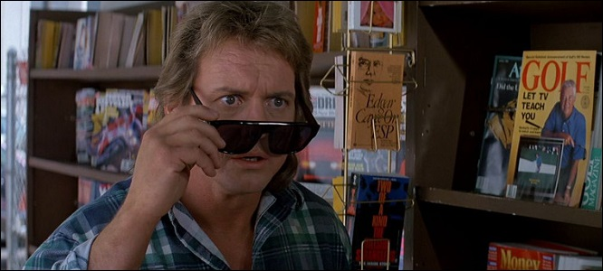
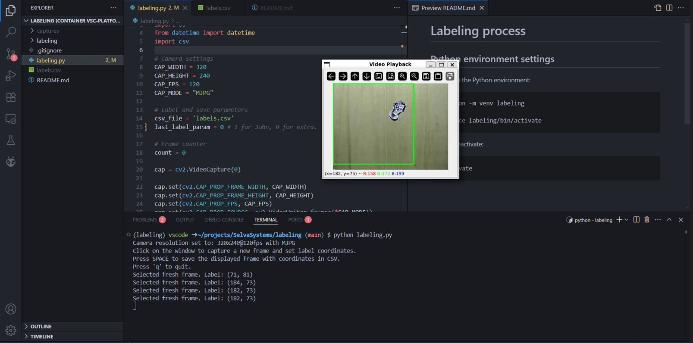

<div align="center">

# 👽 Alien vs Human Dataset 👓



</div>

## 🎯 Content

This repository contains a dataset designed for **demonstration purposes**, taking inspiration from the John Carpenter’s movie *They Live* (1988), available for free on the YouTube platform, to explore object detection and classification pipelines using two well-known machine-learning models:

- **[Google's MobileNetV2](https://www.tensorflow.org/api_docs/python/tf/keras/applications/MobileNetV2)[^1] (classification)**
- **[Ultralytics' YOLOv8n](https://docs.ultralytics.com/models/yolov8/)[^2] (object detection)**

[^1]: Mark Sandler, Andrew Howard, Menglong Zhu, Andrey Zhmoginov, Liang-Chieh Chen (2019). *MobileNetV2: Inverted Residuals and Linear Bottlenecks* (Version 4.0.0) [cs.CV]. https://arxiv.org/abs/1801.04381

[^2]: Glenn Jocher, Ayush Chaurasia, Jing Qiu (2023). *YOLO by Ultralytics* (Version 8.0.0) [Computer software]. https://github.com/ultralytics/ultralytics

Almost the same dataset is provided, arranged to fit each model’s requirements, allowing you to experiment with both workflows side-by-side.

### Dataset Constitution

- **Images:** Size 224x224 with consistent scenes and objects under controlled conditions.
- **Capture:** USB 2Mpx Camera, Variable focal length, 2.8-12mm lens, Manual focus, 320x240 MJPG @ 120FPS.
- **Lighting:** LED Spot lighting to reduce shadows and reflections.
- **Background:** A wooden plank.

### 📜 License

- **Datasets (`data_mnetv2/`, `data_yolov8n/`):** Released under the [Open Data Commons Public Domain Dedication and License (PDDL) v1.0](LICENSES/PDDL-1.0.txt).
- **Code:** Released under the [MIT No Attribution License](LICENSES/MIT-0.txt).

The code is intended to be adapted as needed depending on your specific model training requirements.

### ✨ Credits

I would like to thank [**Selva Systems**](https://selvasystems.net/), where I completed my internship, for providing the resources that allowed me to capture this dataset, then train and test a [YOLOv8n](https://docs.ultralytics.com/models/yolov8/) model on an [Orange Pi Zero 3](http://www.orangepi.org/html/hardWare/computerAndMicrocontrollers/details/Orange-Pi-Zero-3.html) SBC, with the [Coral USB Accelerator](https://coral.ai/products/accelerator), as part of a project described in my [Edge AI with Orange Pi](https://github.com/chxadr/edgeai-orangepi) repository.

## 🏗️ Build a Dataset

To create a dataset, you will need to **capture a variety of images** featuring the objects that your model needs to recognize. You need to figure out how many class you want to use, in which class an object belongs to, and what level of details a class represents. It is important to know the required **input image size** for the model, as well as **the expected label format**.

### Images

To ensure the robustness of a model in real-world conditions, it is essential that the training dataset be **representative of the diversity and proportion** of the detection cases encountered. Therefore, the most common situations in the final usage must be sufficiently present in the training set, while rarer cases should also be included in limited quantities to cover as many possible scenarios as possible. Such balance allows the model to **generalize properly and minimize biases** due to overrepresentation or lack of diversity in the data.

However, **building a large dataset can be time-consuming and expensive**, depending on your task and objectives. As a result, you might consider using **data augmentation techniques** to artificially generate additional images. Many model APIs already incorporate these strategies into their pipelines, sometimes to a point that you do not even need to think about it.

When it comes to data distribution, it is **best practice to maintain a balanced number of instances per class** in both the *training* and *validation* datasets. If certain classes dominate, it **can lead to poor generalization** — both during validation and at runtime.

### Labeling Process

Implementing a labeling process can be a challenge depending on your task. However, graphical tools like [Label Studio](https://github.com/HumanSignal/label-studio), [CVAT](https://github.com/cvat-ai/cvat), [Labelme](https://github.com/wkentaro/labelme) and [LabelImg](https://github.com/HumanSignal/labelImg), can help you a lot. Scripts made from various programming langages are also a viable (and fun) option.

Numerous annotation types exist, such as **2D or 3D bounding boxes, polygons, landmarks, and masks**. Object detection models typically use bounding boxes, which are relatively straightforward to annotate. In contrast, instance segmentation models often require more detailed formats like polygons or landmarks to capture finer object shapes.

Depending on how you decided to build and train your model — and which tools or frameworks you're using — the labeling structure, i.e. how the labels are stored and linked to the images, can vary significantly. For example, with TensorFlow and Keras Python APIs, you have flexibility in how labels are structured. In contrast, when using the YOLO Python API, you must adhere to a specific labeling convention.

## 🔎 Practical Example

### Description

Using an [Orange Pi Zero 3](http://www.orangepi.org/html/hardWare/computerAndMicrocontrollers/details/Orange-Pi-Zero-3.html) single-board computer, paired with a [Coral USB Accelerator](https://coral.ai/products/accelerator), our objective was to deploy a lightweight, easy-to-train and easy-to-deploy AI detection model, and evaluate its performance within a constrained hardware environment. Over the course of only a four-weeks internship, we wanted to develop a prototype system designed to respond to a specific event.

For entertainment purposes, we chose to build a system capable of detecting two key characters from John Carpenter’s film *They Live*: John Nada and the aliens. The system is programmed to react only when aliens are detected, by pointing a laser at them.

**The first step was selecting an appropriate object detection model and training it with labeled images, which we needed to collect ourselves.** Our initial idea was to use a custom detection model based on *MobileNetV2*. However, due to time constraints, we were unable to fine-tune its hyperparameters and find an optimal configuration. While *MobileNetV2* paired with *SSD* was also an option, we ultimately chose *YOLOv8n*, as it offers a streamlined training process and includes built-in features such as data augmentation with mosaic, making it more suitable given our limited development time, while being suited for real-time objects detection.

### Image Capture and Labeling

The datasets `data_mnetv2` and `data_yolov8n` were build under the conditions described in [Dataset Constitution](#dataset-constitution). These two datasets actually contains the same images. The only difference is that for the first one, we wanted to have background captures as well, but it turns out that it was not necessary at all.

Since our goal was to develop a prototype as quickly as possible — even at the cost of limiting the system’s features — we collected approximately 500 images of John Nada and 500 images of the aliens, with only one instance per image. Capturing and labeling these 1000 images took around three hours, which is relatively fast.

Initially planning to use a *MobileNetV2*-based detection model, we developed two Python scripts for the data collection and labeling process: `mnetv2_burst_labeling.py` and `mnetv2_manual_labeling.py`. The first script allowed us to capture and label background images at fixed center coordinates, to later continuously feed the system with coordinates — even when no relevant object was present in the frame.

However, we found this approach to be more resource-intensive and error-prone than beneficial, for several reasons:

- **Unnecessary motor movement:** It is better for the system to remain still when no target object is detected. Since we use stepper motors to control two mirrors that direct the laser, avoiding unnecessary movement prevents wear and reduces positional drift (step errors).

- **Background class complexity:** Training the model to explicitly recognize background increases the model’s complexity. Given that our target objects are relatively small in the frame, including background as a class may lead the model to generate unnecessary or ambiguous predictions, adding computational overhead without meaningful benefit.

The second script was used to capture and label images of John Nada and the aliens. For each image, absolute instance center coordinates were selected manually using a simple GUI: a left mouse click on the displayed image set the coordinates and captured a new image simultaneously. Users could repeat this process until the selected coordinates were satisfactory. Pressing the space bar then saved both the image and its associated label.

> [!NOTE]
> Those scripts have been modified a little since we built the datasets, to make them more convenient to use and understand.

</div>

<div align="center">



***Figure 1:** Usage of our script to capture and label images.*

</div>

Labels and their corresponding images were stored in a CSV file by both scripts, using the following structure:

```
<class_name>_<n>.jpg,<center_x>,<center_y>,<class_id>
```

where `<class_name>` is either `john`, `alien` or `background`, `<n>` is a unique index to differenciate images of same class, and `<class_id>` is an integer for the network to numerically represent each class.

### Rearranging the Dataset

However, this CSV-based structure was no longer suitable once we transitioned to using YOLOv8.

To align with YOLOv8’s format requirements, we first had to convert the absolute center coordinates into values relative to the image width and height. Additionally, we needed to define bounding boxes for each labeled instance. Since both John Nada and alien objects were consistently similar in size, we opted to use fixed bounding box dimensions for all samples.

To automate this conversion, we used a Python script called `mnetv2_to_yolov8n_labels.py`, which reformatted our dataset to comply with the Ultralytics YOLOv8 API. During this process, we also removed all background images.

The result of this conversion was our second, YOLO-compatible dataset.
